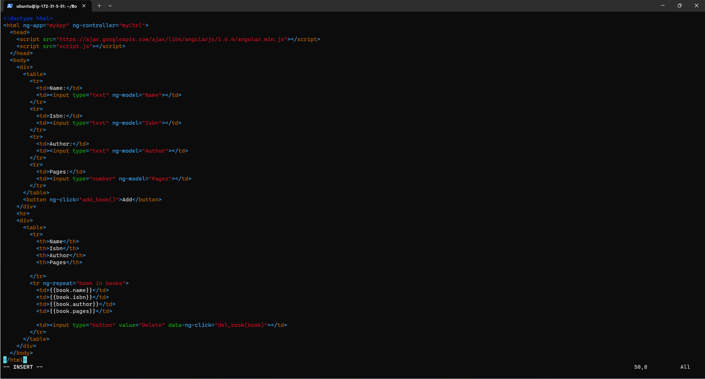

## **Documentation for Project 4 MEAN Stack Deployment**

### nodejs Installation and Adding Certificates
`sudo apt update`

`sudo apt -y install curl dirmngr apt-transport-https lsb-release ca-certificates`

`curl -sL https://deb.nodesource.com/setup_12.x | sudo -E bash - `

`sudo apt install -y nodejs`

### MongoDB Installation and Running 
`sudo apt install -y mongodb`

`sudo service mongodb start`

`sudo systemctl status mongodb`

`mkdir Books && cd Books`

`npm init`

`vi server.js`

### NPM Installation and body parser
`sudo apt install -y npm`

`sudo npm install body-parser`

## Step 2

### Mongoose Installation
`sudo npm install express mongoose`

`mkdir apps && cd apps`

`vi routes.js`

`mkdir models && cd models`

`vi book.js`

`mkdir public && cd public`

`vi script.js`

`vi index.html`

`node server.js`

### Book Register app Live on web

